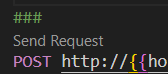

Local development of the edge function before pushing it on the cloud <3 

Instruction on how to use for my bestie (i changed some things, so I will update on how to test later):
1. Install deno using: npm install -g deno
2. Install extension denoland from vscode extension
3. Install the vscode extension REST Client
4. Run `deno run dev` on command line 
5. Send post request using requests/testing.rest  

Source:
> Wordlist: https://www.gutenberg.org/files/3201/3201-h/3201-h.htm
